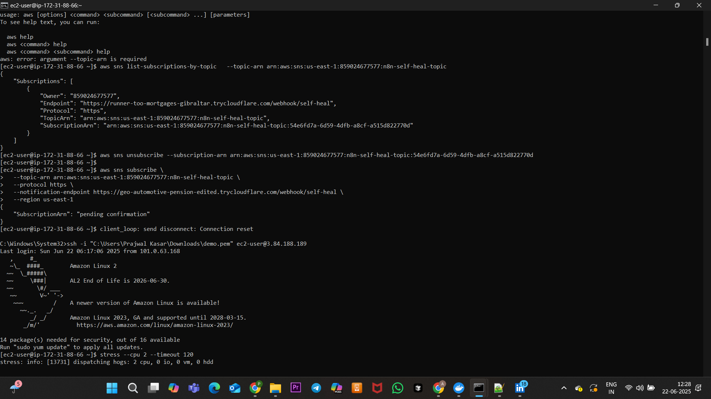
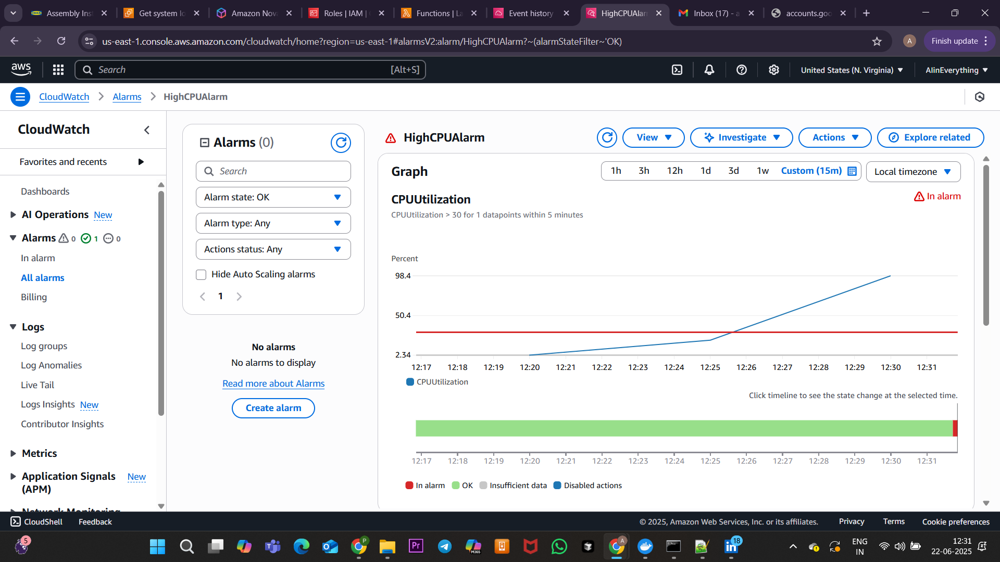
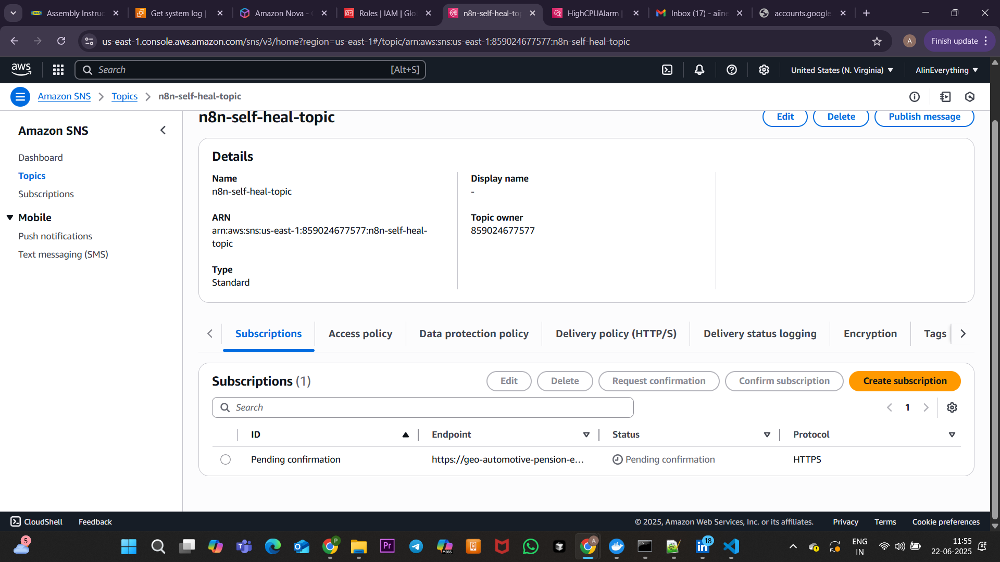
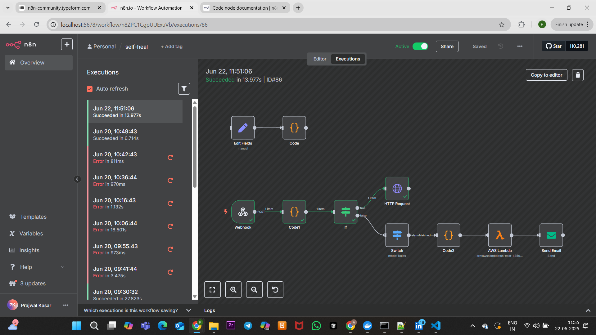
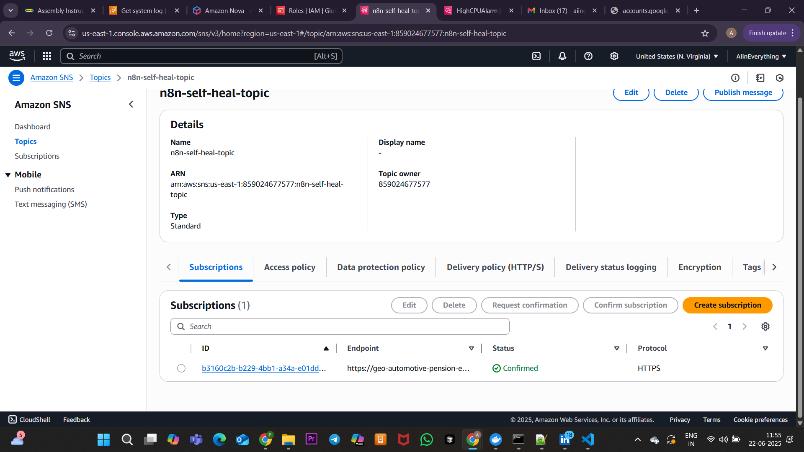
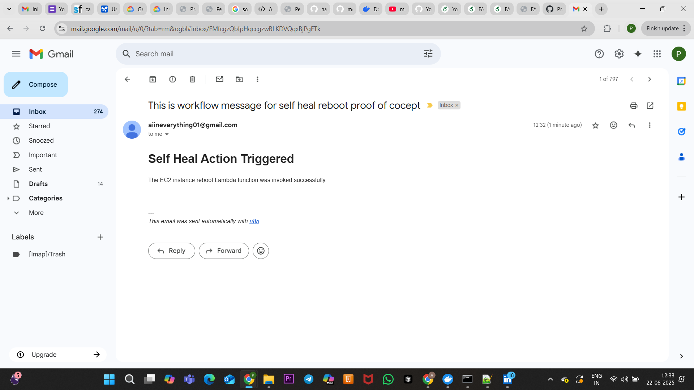
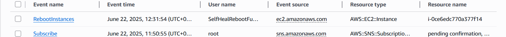

# 🛠️ Self-Healing EC2 Reboot Workflow using n8n + AWS Lambda + CloudWatch

This project sets up a **self-healing mechanism** for EC2 instances based on **CloudWatch alarms**, **SNS notifications**, and an **n8n workflow** that invokes a Lambda function to reboot the instance. You also receive an **email notification** upon reboot.

---

## 📌 Components Used

* AWS EC2
* AWS CloudWatch (Alarm)
* AWS SNS (Topic + Subscription)
* AWS Lambda (Reboot Function)
* n8n (No-code/low-code orchestration)
* Cloudflare Tunnel (for webhook exposure)
* Email (SMTP for notification)
* AWS CloudTrail (for audit logs)

---

## 🧱 Setup Instructions (with Visual References)

### ✅ 1. Launch an EC2 Instance

1. Go to **AWS Console > EC2 > Launch Instance**
2. Choose **Amazon Linux 2 AMI**
3. Select t2.micro (Free Tier)
4. Add tag: `Name=self-heal-test`
5. Configure security group:

   * Allow SSH (port 22)
6. Launch and download the key pair

### ✅ 2. SSH into Instance & Install `stress`

```bash
ssh -i <your-key.pem> ec2-user@<instance-public-ip>
sudo yum install stress -y
```

To simulate high CPU load:

```bash
stress --cpu 2 --timeout 60
```


🔹 *Simulating high CPU load on the EC2 instance using `stress` command to trigger CloudWatch alarm.*

---

### ✅ 3. Create CloudWatch Alarm

1. Go to **CloudWatch > Alarms > Create Alarm**
2. Metric: `EC2 > Per-Instance Metrics > CPUUtilization`
3. Condition: `Greater than 30% for 1 datapoint`
4. Action: Create new SNS topic `n8n-self-heal-topic`


🔹 *CloudWatch alarm goes into ALARM state after CPU threshold breach.*

---

### ✅ 4. Create SNS Topic & Confirm Subscription

1. Topic name: `n8n-self-heal-topic`
2. Add HTTPS subscription:

```bash
aws sns subscribe \
  --topic-arn arn:aws:sns:us-east-1:859024677577:n8n-self-heal-topic \
  --protocol https \
  --notification-endpoint https://<cloudflare-url>/webhook/self-heal \
  --region us-east-1
```

**After running the subscribe command:**


🔹 *This shows the SNS subscription is in the "PendingConfirmation" state.*

**Workflow executed to confirm subscription:**


🔹 *The workflow executed the true branch of `If` node to confirm subscription.*

**SNS subscription confirmed:**


🔹 *HTTPS subscription successfully confirmed.*

---

### ✅ 5. Setup Cloudflare Tunnel

```bash
cloudflared tunnel --url http://localhost:5678
```

Use the URL it gives as your SNS HTTPS endpoint.


🔹 *Tunnel URL to expose n8n webhook to the internet.*

---

### ✅ 6. Create AWS Lambda

**Name:** `SelfHealRebootFunction`

**IAM Role Permissions:**

```json
{
  "Effect": "Allow",
  "Action": [
    "ec2:RebootInstances",
    "logs:CreateLogGroup",
    "logs:CreateLogStream",
    "logs:PutLogEvents"
  ],
  "Resource": "*"
}
```

**Code:**

```python
import boto3

ec2 = boto3.client('ec2')

def lambda_handler(event, context):
    instance_id = event.get('instanceId')
    if not instance_id:
        return {"statusCode": 400, "body": "Missing instanceId"}

    try:
        ec2.reboot_instances(InstanceIds=[instance_id])
        return {"statusCode": 200, "body": f"Instance {instance_id} rebooted successfully."}
    except Exception as e:
        return {"statusCode": 500, "body": str(e)}
```


🔹 *Lambda function created and deployed.*

---

### ✅ 7. n8n Workflow Setup

Import the workflow JSON shared in this repository.

**Logic Flow:**

* Webhook receives SNS message
* Code node parses and merges message
* `If` node checks for `SubscriptionConfirmation`
* HTTP node confirms subscription
* Switch node checks if `NewStateValue == ALARM`
* Code extracts `instanceId`
* Lambda is invoked
* Email is sent


🔹 *n8n successfully invokes Lambda function to reboot instance.*

---

### ✅ 8. Email Notification

You will receive an email confirmation of reboot.


🔹 *Email confirmation for triggered self-heal action.*

---

### ✅ 9. CloudTrail (Optional)

Confirm reboot via AWS CloudTrail:

1. Go to **CloudTrail > Event History**
2. Filter: `Event Name = RebootInstances`


🔹 *CloudTrail shows the Lambda initiated reboot event.*

---

## 📂 Folder Structure

```
self-healing-ec2-n8n/
├── README.md
├── n8n
│   └── selfhealworkflow.json
├── scripts/
│   └── reboot_instance.py
└── screenshots/
    ├── Subscription_Pending.png
    ├── Workflow_exe_1.png
    ├── Subscription_confirmed.png
    ├── Stress_EC2.png
    ├── In_Alarm.png
    ├── Workflow_executed.png
    ├── Auto_Email_recived.png
    └── reboot_event.png
```

---

## ✅ Final Confirmation Checklist

* ✅ CloudWatch Alarm fires on CPU > 30%
* ✅ SNS sends alert to n8n webhook
* ✅ Subscription confirmed
* ✅ Lambda function triggered
* ✅ EC2 instance rebooted
* ✅ Email received
* ✅ Logs visible in CloudWatch & CloudTrail

---

📩 Questions?
Open an issue or reach out directly:

📧 Email: prajwalkasar15@gmail.com

💼 LinkedIn: https://www.linkedin.com/in/prajwal-kasar